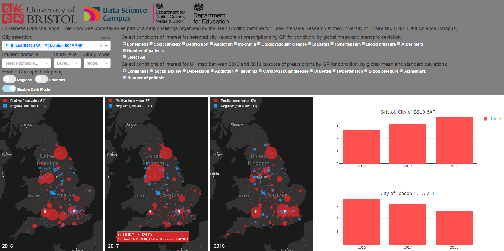
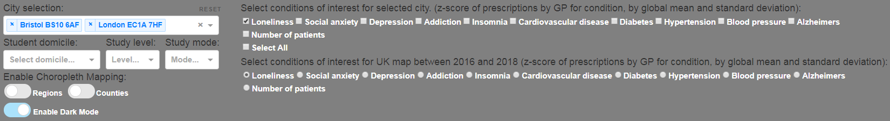
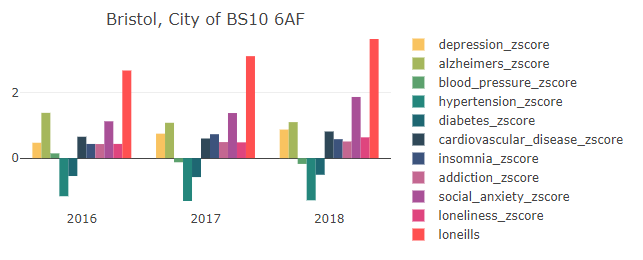
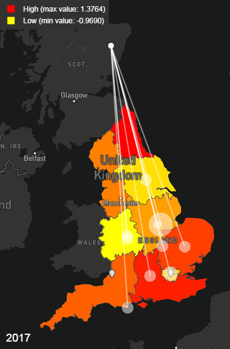
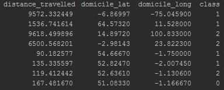
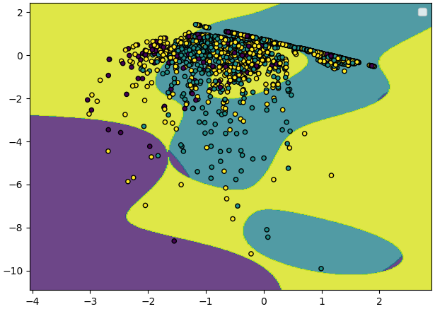

```{r setup, include=FALSE}
knitr::opts_chunk$set(echo = TRUE)
library(tidyverse)
library(scales)

knitr::opts_chunk$set(fig.align = "center")
```
<br>
<br>

---

# About this report {-}
This work was undertaken as part of the "_Movement of people for education and loneliness_" Data Challenge organised by the Jean Golding Institute for Data-Intensive Research at the University of Bristol and ONS.

The report is broken into three sections:

  * [Section 1](#section1) describes the data visualisation website we have created to allow us and other users to explore the data provided by the JGI.
  * [Section 2](#section2) describes the data cleaning and analysis methods used to perform a simple linear regression analysis of the relationship between loneliness and movement/migration for education. 
  * [Section 3](#section3) takes the analysis a step further, using machine learning methods in an attempt to predict if loneliness is linked to the distance between a students domicile and place of study.
  
The following people contributed to this report:

  * Axel Montout, PhD Student, Bristol Veterinary School
  * Lucy Vass, PhD Student, Bristol Veterinary School
  * Luke McGuinness, PhD Student, Department of Population Health Sciences
  
This report was written in R Markdown. The .Rmd version can be found [here](https://github.com/mcguinlu/JGI-Comp/blob/master/index.Rmd).

<br>
<br>

---

# Data visualisation {#section1}
## Visualization of the data provided for the Loneliness data challenge



In an attempt to better understand the data provided a visualization program displaying the geographic and time distribution of the z-score provided was developed. The program takes form as a website accessible at the following web address <http://51.38.69.55/>.

**The program is hosted on a low performance private server. Acces to this server provided by the link above is for basic demonstration purposes. For proprer use and user interaction the program should be hosted on an appropriate server.**

The source code for the database generation and the visualization is available [here]( https://github.com/mcguinlu/JGI-Comp/tree/master/visualization).

The following section explains the different features of the site.

## Control panel
Located in the upper section of the site the control panel allows to select what information will be displayed in the lower section.




## Bar graph
In the lower section on the right side is displayed the bar graph(s) representing the data of the cities selected in the control panel where one or multiple condition of interest can as well be selected. The x-axis shows the year of the data collection. The y-axis displays the z-score value(s) of the selected condition(s).    



## Map
In the lower section on the left is displayed 3 maps. They each displays the data for one year. The available years are 2016, 2017 and 2018. The data for only one condition can be displayed at a time. Different visualization mode are available including choropleth map of the regions or counties in England which uses gradiant coloring of the location. In addition, Scatter map which distinguishes data using different colors and sizes of the data points.


## Student migration
In order to visualize the migration of students from abroad to England the following data-set provided by HESA(Higher Education Statistics Agency) was used: https://www.HESA.ac.UK/data-and-analysis/students/table-11
The data-set information on the number of students moving to each English region, the domicile of the students, as well as their mode and level of study between 2014 and 2018.




Data visualization is an important step which allow a better understanding of any data-set before analysis. Here the data provided is displayed in different form such that a clear view of the data distribution in England is achieved.  

  
<br>
<br>

---


# Association of loneliness with migration for education {#section2}
## Background
### Research question

**_Question: Does the movement of students to a different region of England for education associate with increased lonliness in their county or region of origin?_**

In addition to the general visualisation of the data-sets provided by the JGI Data Competition and others sourced online in [Section 1](#section1), we wanted to explore the hypothesis that students leaving their county/region to travel to a different region of the country for higher education might be associated with the loneliness score in that county/region.

We choose this question because we believe the effect of student migration on those left behind is often overlooked in terms of analysis/interventions, with the focus usually being placed on preventing loneliness in students arriving in a new location. 

### Hypotheses

  1. Outward migration for education at the county level is associated with the mean loneliness score for that county.
  2. Outward migration for education at the regional level is associated with the mean loneliness score for that region.
  3. Total student migration for education (number of students leaving plus number of students arriving) at the regional level is associated with the mean loneliness score for that region.
  
### Code availability
**Note:** All code used within this section is available for review. You can view it by clicking the "Code"" button on the right hand side of the screen within a specific sub-section. For example:

```{r}
# This is a demonstration of how code is presented within this section! 
```

*** 

## Datasets

The data-sets used in this analysis are laid out below, and where appropriate, a link to their source is provided. For familiarity, the first few rows of each data-sets are presented.

<br>

### NSO Lonliness Score {#lonliness-score-data}
Sourced from the JGI Data Competition team.

```{r, echo =FALSE}
data.lonliness <- read.csv("data/msoa_loneliness.csv")
colnames(data.lonliness)[1] <- "msoa11cd"
knitr::kable(head(data.lonliness))
```

<br>

### Student migration for education dataset {#student-migration-data}
Sourced from the [HESA website](https://www.hesa.ac.uk/data-and-analysis/students/where-from), this data-set describes the number of students moving to each region from a given domicile/town.

```{r, echo =FALSE}
data.move <- read.csv("data/Movement data.csv", header = FALSE)

# Remove description of dataset
data.move <- data.move[18:nrow(data.move),]

# Add first row to column headers and delete first row
colnames(data.move) = make.names(as.character(unlist(data.move[1, ])))
data.move = data.move[-1, ]

knitr::kable(head(data.move))
```

<br>

### Town/County/County List {#town-county-data}
Sourced from [here](https://www.paulstenning.com/uk-towns-and-counties-list/), this data-set matches town names to their respective counties and countries.

```{r, echo =FALSE}
town.county <- read.csv("data/Towns_List.csv")
knitr::kable(head(town.county))
```

<br>

### County/Region List {#county-region-data}
Sourced from [here](https://wiki.freecycle.org/UK_Counties_and_Regions), this data-set matches counties to their respective regions.

```{r, echo =FALSE}
county.region <- read.csv("data/county.region.csv", stringsAsFactors=FALSE, header = TRUE)
colnames(county.region)[1] <- "County"
knitr::kable(head(county.region))
```

<br>

### District/County List {#district-county-data}
Sourced from [here](https://en.wikipedia.org/wiki/List_of_English_districts), this data-set matches districts to their respective counties.

```{r, echo =FALSE}
district.county <- read.csv("data/district-county.csv", stringsAsFactors=FALSE, header = TRUE)
colnames(district.county)[1] <- "District"
knitr::kable(head(district.county))
```


***

<br>

## Preparation for analysis
### Create the combined towns, counties and regions dataset {#town-county-region}

To create a single data-set which matched towns to their respective counties and regions, we merged data-sets [3](#town-county-data) & [4](#county-region-data), on the basis of county name. We also removed country information after limiting the new data-set to towns/counties/regions in England.

```{r town.county.region list, e}
# Import town.county list, and limit to towns in England
town.county <- read.csv("data/Towns_List.csv")
town.county <- town.county[which(town.county$Country=="England"),]
town.county <- town.county[,c(1:2)]

# Import county.region list
county.region <- read.csv("data/county.region.csv", stringsAsFactors=FALSE, header = TRUE)
colnames(county.region)[1] <- "County"

# Merge above datasets on the basis of county to create town.county.region data 
town.county.region <- merge(town.county, county.region)
```

```{r, echo = FALSE}
town.county.region.head <- town.county.region[,c(2,1,3)]

knitr::kable(head(town.county.region.head), caption = "Top six rows of the town.county.region dataset")
```


### Creating complete migration dataset {#new-migration-dataset}

In order to prepare for later analyses, we added county and region information to the HESA data, using the newly created data-set in [Section 2.3.1](#town-county-region) above. The first few lines of the resulting data-set are presented below.

```{r}
# Read in HESA student migration
data.move <- read.csv("data/Movement data.csv", header = FALSE)

# Clean dataframe of description and correct column names
data.move <- data.move[18:nrow(data.move),]
colnames(data.move) = make.names(as.character(unlist(data.move[1, ])))
data.move = data.move[-1, ]
data.move <- as_tibble(data.move)

# Remove "City of" from Domicile column to aid merging
data.move <- data.move %>%
  mutate(Domicile = gsub("City of ", "", Domicile))

# Merge on basis of county name
tmp1 <- merge(data.move, county.region, by.x = "Domicile", by.y = "County")
colnames(tmp1)[1] <- "County"

# Merge on basis on town name
tmp2 <- merge(data.move, town.county.region, by.x = "Domicile", by.y = "Town")
tmp2 <- tmp2[,c(2:9)]

# Combine the two merged datasets created above
countydata <- rbind(tmp1, tmp2)
```

```{r, echo = FALSE}
countydata.head <- countydata[,c(1,8,5,3,4,6,7)]
knitr::kable(head(countydata.head), caption = "Top six rows of the movement for education dataset, with additional information on county and region of origin")
```

### Handling dates

We ran into issues around how to convert the academic year (used in the student migration [data](#student-migration-data)) to the calendar year (used in the loneliness index [data](#lonliness-score-data)).

We decided to assign the full effect of migration in a given academic year to it's earliest calendar year, on the basis that the effect of student migration on loneliness is likely to be most acute in the months immediately after their departure. As an example, the 2014/2015 academic year was re-coded as 2014.

However, taking this approach meant that there was mismatch between the student migration data (2014 to 2017) and the loneliness score data (2016 to 2018). As a result, all subsequent analysis are limited to the two years where data was available from both sources: 2016 and 2017.

``` {r}
countydata <- countydata %>%
  mutate(
  Academic.Year = gsub("2014/15", "2014", Academic.Year),
  Academic.Year = gsub("2015/16", "2015", Academic.Year),
  Academic.Year = gsub("2016/17", "2016", Academic.Year),
  Academic.Year = gsub("2017/18", "2017", Academic.Year)
  )

```

### Creating outward migration for education figure at the county level

In keeping with our research question, to prepare the data-set to examine the effect on loneliness within a county of students moving out of the county to study, we:

  * Removed the totals rows to prevent double counting
  * Removed students enrolled in The Open university, as this is primarily a distance learning institution, and so students would not have to travel to attend this institution. 
  * Removed students those whose institution was in the same region which they came from. This was used as a proxy for a substantial distance between home county and university.

```{r}
countydata.trimmed.out <- filter(
  countydata,
  Region.of.HE.provider != "Total England" &
  Region.of.HE.provider != "Total United Kingdom" &
  Region.of.HE.provider != "The Open University in England" &
  Region.of.HE.provider != Region
  )
```

We then summed all those leaving a county to attend a university in a different region of the UK to create an outward migration for education figure. The plot below shows the results of this analysis for 2016.

Note: the plot below shows 47 of the 48 counties in England. We had limited the analysis to England in [Section 2.3.2]({#new-migration-dataset}) as we only had loneliness data for this country. Further, the City of London is not shown below, as it was included as part of Greater London in the student migration data.

``` {r fig1, fig.height = 10}

# Create sum of people moving from each county in 2016
data.outof.domicile <- filter(countydata.trimmed.out, X4.way.domicile == "All", Level.of.study == "All", Mode.of.study == "All") %>%
  group_by(Academic.Year, County) %>%
  summarise(sum.no = sum(as.numeric(as.character(Number))))

# Filter data to 2016/2017
fig1.data <- data.outof.domicile[which(data.outof.domicile$Academic.Year=="2016" | data.outof.domicile$Academic.Year=="2017"),]

# Create plot
ggplot(fig1.data, aes(x = reorder(County,sum.no), y=sum.no)) +
  facet_grid(.~Academic.Year) +
  geom_bar(stat="identity") +
  coord_flip() +
  labs(x = "County (England only)",
       y = "Total number of students moving from the specififed county", 
       title = "Outward movement of students for education \n (county level)") +
  scale_y_continuous(breaks=seq(0, 175000, 50000),label = scales::comma, expand=c(0.05,0))+
  theme(plot.margin = unit(c(1,1,1,1), "cm"),
        plot.title = element_text(hjust = 0.5))
```

### Creating outward migration for education figure at the regional level
To address our second hypothesis, we create an outward migration for education figure at the regional level. The results of this are presented below.
```{r}
# Building on the intital analysis done above
data.outof.region <- filter(countydata.trimmed.out, X4.way.domicile == "All", Level.of.study == "All", Mode.of.study == "All") %>%
  group_by(Academic.Year, Region) %>%
  summarise(no.out = sum(as.numeric(as.character(Number))))

# Filter data to 2016
data.outof.region.plot <- data.outof.region[which(data.outof.region$Academic.Year=="2016" | data.outof.region$Academic.Year=="2017"),]

# Create plot
ggplot(data.outof.region.plot, aes(x = reorder(Region, no.out), y=no.out)) +
  facet_grid(Academic.Year~.) +
  geom_bar(stat="identity", fill = "#56B4E9") +
  coord_flip() +
  labs(x = "Region (limited to England)",
       y = "Total number of students moving from this region",
       title = "Outward movement of students for education (region level)")+
  scale_y_continuous(label = scales::comma, expand=c(0.05,0)) +
  theme(plot.margin = unit(c(1,1,1,1), "cm"),
        plot.title = element_text(hjust = 0.5))
```

### Total change in population (inward + outward movement) per region due to migration for education
To address our final hypothesis, we created a total migration for education figure (number of students leaving the region plus number of students arriving in the region) per region. 

We created a assumptive rather than net migration for education per region figure on the basis that having students moving into a region is more likely to increase loneliness than reduce it, as they will not simply replace the students who left in terms of social contacts, plus they might possibly be homesick/lonely themselves.

```{r }
# Limit dataset to those travelling to HE provider within England
countydata.trimmed.in <- countydata

countydata.trimmed.in$Region.of.HE.provider <- as.character(countydata.trimmed.in$Region.of.HE.provider)

countydata.trimmed.in$Region.of.HE.provider <- ifelse(countydata.trimmed.in$Region.of.HE.provider == "East of England","East", countydata.trimmed.in$Region.of.HE.provider)

countydata.trimmed.in$Region.of.HE.provider <- ifelse(countydata.trimmed.in$Region.of.HE.provider == "Yorkshire and The Humber","Yorkshire & Humber", countydata.trimmed.in$Region.of.HE.provider)

countydata.trimmed.in <- filter(
  countydata.trimmed.in,
    Region.of.HE.provider == "West Midlands" |
    Region.of.HE.provider == "Yorkshire & Humber" |
    Region.of.HE.provider == "South West" |
    Region.of.HE.provider == "South East" |
    Region.of.HE.provider == "North West" |
    Region.of.HE.provider == "North East" |
    Region.of.HE.provider == "London" |
    Region.of.HE.provider == "East"|
    Region.of.HE.provider == "East Midlands",
    Region.of.HE.provider != Region
)

countydata.trimmed.in$Region.of.HE.provider <- as.character(countydata.trimmed.in$Region.of.HE.provider)

countydata.trimmed.in$Region.of.HE.provider <- ifelse(countydata.trimmed.in$Region.of.HE.provider == "East of England","East", countydata.trimmed.in$Region.of.HE.provider)

countydata.trimmed.in$Region.of.HE.provider <- ifelse(countydata.trimmed.in$Region.of.HE.provider == "Yorkshire and The Humber","Yorkshire & Humber", countydata.trimmed.in$Region.of.HE.provider)

# Create sum of people moving into each region of England
data.into.region <- filter(countydata.trimmed.in, X4.way.domicile == "All", Level.of.study == "All", Mode.of.study == "All") %>%
  group_by(Academic.Year, Region.of.HE.provider) %>%
  summarise(no.in = sum(as.numeric(as.character(Number))))

colnames(data.into.region)[2] <- "Region"

# Create dataframe of total population chance due to migration
data.sum.migration <- merge(data.into.region, data.outof.region)

data.sum.migration <- data.sum.migration %>%
  mutate(no.total = no.in + no.out)

# Filter data to 2016/2017
fig2.data.1 <- data.into.region[which(data.outof.region$Academic.Year=="2016" | data.outof.region$Academic.Year=="2017"),]
fig2.data.1[4] <- "Inwards"
colnames(fig2.data.1)[4] <- "Direction"
colnames(fig2.data.1)[3] <- "No"
fig2.data.2 <- data.outof.region[which(data.outof.region$Academic.Year=="2016" | data.outof.region$Academic.Year=="2017"),]
fig2.data.2[4] <- "Outwards"
colnames(fig2.data.2)[4] <- "Direction"
colnames(fig2.data.2)[3] <- "No"

fig2.data <- rbind(fig2.data.1,fig2.data.2)

# Plot results
ggplot(fig2.data, aes(x = reorder(Region,No), y= No, fill = Direction)) +
  facet_grid(Academic.Year~.) +
  geom_bar(stat="identity") +
  coord_flip() +
  labs(x = "Region (limited to England)",
       y = "Total number of students moving into/out of region",
       title = "Total population change due to migration for education \n (region level)") +
  scale_y_continuous(label = scales::comma, expand=c(0.05,0)) +
  scale_fill_manual(values=c("#E69F00", "#56B4E9")) +
  theme(plot.margin = unit(c(1,1,1,1), "cm"),
        legend.position="bottom",
        plot.title = element_text(hjust = 0.5))


```

### Add county and regional data to loneliness dataset

The final element of pre-analysis preparation involved adding county and regional data to the loneliness [data](#lonliness-score-data). This was complicated by the fact that the loneliness data-set presented the loneliness score per district rather than per county. We used the District/County [dataset](#district-county-data) to map districts to their corresponding counties, and subsequently added regional information as well.

``` {r}
data.lonliness <- read.csv("data/msoa_loneliness.csv")

data.lonliness <- data.lonliness %>%
  mutate(District = gsub('[[:digit:]]+', '', msoa11nm),
         District = gsub(" $","", District, perl=T))

# Add county Level information
district.county <- read.csv("data/district-county.csv")

colnames(district.county)[1] <- "District"

data.lonliness <- merge(data.lonliness,district.county,by="District",all.x=TRUE)

data.lonliness$County <- as.character(data.lonliness$County)

data.lonliness$County <- ifelse(is.na(data.lonliness$County) == TRUE,"0", data.lonliness$County)

data.lonliness$County <- ifelse(data.lonliness$District == "Bournemouth", "Dorset", data.lonliness$County)

data.lonliness$County <- ifelse(data.lonliness$District == "Stockton-on-Tees", "County Durham", data.lonliness$County)
                           
data.lonliness$County <- ifelse(data.lonliness$District == "Poole", "Dorset", data.lonliness$County)  

data.lonliness$County <- ifelse(data.lonliness$District == "Christchurch", "Dorset", data.lonliness$County)

data.lonliness$County <- ifelse(data.lonliness$District == "East Dorset", "Dorset", data.lonliness$County)

data.lonliness$County <- ifelse(data.lonliness$District == "West Dorset", "Dorset", data.lonliness$County)

data.lonliness$County <- ifelse(data.lonliness$District == "North Dorset", "Dorset", data.lonliness$County)

data.lonliness$County <- ifelse(data.lonliness$District == "Purbeck", "Dorset", data.lonliness$County)

data.lonliness$County <- ifelse(data.lonliness$District == "Shepway", "Kent", data.lonliness$County)

data.lonliness$County <- ifelse(data.lonliness$District == "St Edmundsbury", "West Suffolk", data.lonliness$County)

data.lonliness$County <- ifelse(data.lonliness$District == "St. Helens", "Merseyside", data.lonliness$County)

data.lonliness$County <- ifelse(data.lonliness$District == "Forest Heath", "West Suffolk", data.lonliness$County)

data.lonliness$County <- ifelse(data.lonliness$District == "Suffolk Coastal", "East Suffolk", data.lonliness$County)

data.lonliness$County <- ifelse(data.lonliness$District == "Waveney", "East Suffolk", data.lonliness$County)

data.lonliness$County <- ifelse(data.lonliness$District == "Taunton Deane", "Somerset West and Taunton", data.lonliness$County)

data.lonliness$County <- ifelse(data.lonliness$District == "West Somerset", "Somerset West and Taunton", data.lonliness$County)

data.lonliness$County <- ifelse(data.lonliness$District == "Weymouth and Portland", "Dorset", data.lonliness$County)

# Add regional information
county.region <- read.csv("data/county.region.csv")
colnames(county.region)[1] <- "County"

data.lonliness <- merge(data.lonliness, county.region, by="County",all.x=TRUE)

data.lonliness$Region <- ifelse(data.lonliness$County == "West Suffolk",  "East", as.character(data.lonliness$Region))

data.lonliness$Region <- ifelse(data.lonliness$County == "East Suffolk",  "East", as.character(data.lonliness$Region))

data.lonliness$Region <- ifelse(data.lonliness$County == "Somerset West and Taunton", "South West", as.character(data.lonliness$Region))

```

## Analysis

### Association of number of students leaving county (England only) and mean loneliness score for that county
``` {r}
# Summarise by county
mean.lonliness.county <- data.lonliness %>%
  group_by(County) %>%
  summarise("2016" = mean(loneills_2016),
            "2017" = mean(loneills_2017),
            "2018" = mean(loneills_2018))

mean.lonliness.county <- gather(mean.lonliness.county, Academic.Year, mean.score, "2016","2017","2018", factor_key = FALSE)

# Merge with movement data
move.lonliness.county <- merge(mean.lonliness.county, data.outof.domicile)

ggplot(move.lonliness.county, aes(x=sum.no,y=mean.score))+
  facet_grid(Academic.Year~.)+
  geom_point() +
  geom_smooth(method='lm') +
  scale_x_continuous(labels = comma) +
  labs(x = "Total number of students leaving a county",
         y = "Mean loneliness score for that county")

move.lonliness.county.2016 <- move.lonliness.county[which(move.lonliness.county$Academic.Year == 2016),]
move.lonliness.county.2017 <- move.lonliness.county[which(move.lonliness.county$Academic.Year == 2017),]

# Create regression models 
out.county.linearMod.2016 <- lm(mean.score ~ sum.no, data=move.lonliness.county.2016)
out.county.linearMod.2017 <- lm(mean.score ~ sum.no, data=move.lonliness.county.2017)

# Extract p-values
out.county.p.2016 <- (summary(out.county.linearMod.2016)$coefficients[,4])[2]
out.county.p.2017 <- (summary(out.county.linearMod.2017)$coefficients[,4])[2]

```

The correlation coefficients for 2016 and 2017 were `r cor(move.lonliness.county.2016$mean.score, move.lonliness.county.2016$sum.no) ` and  `r cor(move.lonliness.county.2017$mean.score, move.lonliness.county.2017$sum.no) ` respectively, indicating low correlation between the migration for education at the county level and mean loneliness score for that county in either year.

This was supported by further analyses. Linear regression showed poor evidence for an association between mean loneliness score per county and the number of students who have left that county for education reasons (Hypothesis 1). The regression coefficient for 2016 was `r coef(out.county.linearMod.2016)[2]` (p=`r out.county.p.2016`)  and for 2017 was `r coef(out.county.linearMod.2017)[2]` (p=`r out.county.p.2017`).

### Association of number of students leaving region (England only) and mean loneliness score for that region
```{r}
# Summarise by Region
mean.lonliness.region <- data.lonliness %>%
  group_by(Region) %>%
  summarise("2016" = mean(loneills_2016),
            "2017" = mean(loneills_2017),
            "2018" = mean(loneills_2018))

mean.lonliness.region <- gather(mean.lonliness.region, Academic.Year, mean.score, "2016","2017","2018", factor_key = FALSE)

# Merge with movement out of region data
out.move.lonliness.region <- merge(mean.lonliness.region, data.outof.region)

ggplot(out.move.lonliness.region, aes(x=no.out,y=mean.score)) +
  facet_grid(Academic.Year~.) +
  geom_point(aes(colour = Region), size = 2) +
  geom_smooth(method='lm', colour = "#56B4E9") +
  scale_x_continuous(labels = comma) +
  scale_color_brewer(palette="Paired") +
  labs(x = "Total number of students moving leaving a region",
         y = "Mean loneliness score for that region")
  
out.move.lonliness.region.2016 <- out.move.lonliness.region[which(out.move.lonliness.region$Academic.Year == 2016),]
out.move.lonliness.region.2017 <- out.move.lonliness.region[which(out.move.lonliness.region$Academic.Year == 2017),]

# Create regession models 
out.linearMod.2016 <- lm(mean.score ~ no.out, data=out.move.lonliness.region.2016)
out.linearMod.2017 <- lm(mean.score ~ no.out, data=out.move.lonliness.region.2017)
             
# Extract p-values            
out.p.2016 <- (summary(out.linearMod.2016)$coefficients[,4])[2]
out.p.2017 <- (summary(out.linearMod.2017)$coefficients[,4])[2]

```

Similar to the county level, there was little evidence for an association between migration for education at the regional level and mean loneliness score for that region (Hypothesis 2). The correlation coefficients for 2016 and 2017 were `r cor(out.move.lonliness.region.2016$mean.score, out.move.lonliness.region.2016$no.out)` and  `r cor(out.move.lonliness.region.2017$mean.score, out.move.lonliness.region.2017$no.out)` respectively, while the linear regression coefficient for 2016 was `r coef(out.linearMod.2016)[2]` (p=`r out.p.2016`)  and for 2017 was `r coef(out.linearMod.2017)[2]` (p=`r out.p.2017`).

### Association of total student migration for education per region (total number leaving region plus total number moving to region) and mean loneliness score for that region (England only)

```{r}
data.sum.migration <- data.sum.migration[,c(1,2,5)]

total.move.lonliness.region <- merge(data.sum.migration, mean.lonliness.region)

ggplot(total.move.lonliness.region, aes(x=no.total,y=mean.score)) +
  facet_grid(Academic.Year~.) +
  geom_point(aes(colour = Region), size = 2) +
  geom_smooth(method='lm', colour = "#56B4E9") +
  scale_x_continuous(labels = comma) +
  scale_color_brewer(palette="Paired") +
  labs(x = "Total number of students moving to/from region",
       y = "Mean loneliness score for that region")

total.move.lonliness.region.2016 <- total.move.lonliness.region[which(total.move.lonliness.region$Academic.Year == 2016),]
total.move.lonliness.region.2017 <- total.move.lonliness.region[which(total.move.lonliness.region$Academic.Year == 2017),]

# Create regression models
total.linearMod.2016 <- lm(mean.score ~ no.total, data=total.move.lonliness.region.2016)
total.linearMod.2017 <- lm(mean.score ~ no.total, data=total.move.lonliness.region.2017)

# Extract p-values                         
total.p.2016 <- (summary(total.linearMod.2016)$coefficients[,4])[2]
total.p.2017 <- (summary(total.linearMod.2017)$coefficients[,4])[2]
```

As expected based on the results of the previous two analyses, there was little evidence to support our third and final hypothesis, that there is an association between the total population change in a region due to migration for education and the mean loneliness score for that region. The linear regression coefficient for this analysis for 2016 was `r coef(total.linearMod.2016)[2]` (p=`r total.p.2016`) and for 2017 was `r coef(total.linearMod.2017)[2]` (p=`r total.p.2017`).

## Discussion
### Interpretation of results
There was no evidence that outward migration for education at either the county or regional level had any effect on the mean loneliness score in the county or region. Similarly, there was no evidence for a relationship between total population change (sum of students moving into and out of a region) due to migration for education in a region and the mean loneliness score for that region.

### Limitations of analyses

  * If the migration data had been presented at the district rather than county level, we would have been able to perform the analysis at the district rather than county level. This may have improved the ability of our analysis to detect a relationship between the two variables, if one exists.
  * We used movement to another region of England as a proxy for a substantial distance between county/region of origin and location of the Higher Education provider so that students cannot easily/regularly return to their county of origin. This was made necessary by the data available, but may not represent a valid proxy - for example, a student living close to the border of two regions may attend a Higher Education (H.E.) provide in another region yet still live in their county of origin. A better approach might be to calculate the exact distance between county of origin and location of H.E. provider.
  * We could have included potential confounders in the analysis to examine whether a true association between migration for education and loneliness is being masked. However, we struggled to identify any confounders that would bias the relationship towards the null.
  
<br>
<br>

---

# Machine learning for loneliness score prediction {#section3}
## Research question
**_Is the loneliness of students linked to the distance between their domicile and place of study?_**

## Methods
The Support Vector Algorithm (SVM) is used in an attempt to classify student data into three classes: "lonely", "neutral" or "not lonely". The result of the classifier would therefore be interpreted as the input data corresponding to a student who is likely to be lonely/not likely to be lonely knowing the domicile and the distance traveled between the domicile and the place of study.


By mapping the loneliness score of the region in England to the student H.E. provider location, training sets are created. They contain the longitude and latitude of the student, the distance (km) between the domicile and the H.E. provider and a binary representation of the loneliness z-score.

The classes are defined as follow:
<br>
 - class 0: region loneliness z-score <= 0
 <br>
  - class 1: 0 < region loneliness z-score < 1
 <br>
 - class 2: region loneliness z-score >= 1
 <br>
 
 
 
 
 The Linear Discriminant Analysis (LDA) technique allows to reduce the 3 dimensions( distance traveled, domicile latitude, domicile longitude) data set in a 2D space which can be visualized. 
 
  
  
  
## Results
<br>
Testing and visualization of the data reveals that the features used in the input, namely, the distance traveled, the domicile latitude and longitude do not describe how lonely a student may be. However the input data lack of resolution in the sense that it only takes into consideration the loneliness z-score of the region in England which induce very large amount of bias. Indeed the visualization tool developed shows that the z-score of the counties in England is highly variable. More importantly the distance traveled is not accurate as the exact location of study is not known, only the region of study is known in the data provided by HESA (Higher Education Statistics Agency) https://www.HESA.ac.UK/data-and-analysis/students/table-11.
<br>
Further work would include a repeat of the experiment with data containing the exact migration of the students. The impact of features such as the level of study and mode of study should be explored too. 

  
The source code for the training set generation and the classifier can be found [here]( https://github.com/mcguinlu/JGI-Comp/tree/master/ml).
  