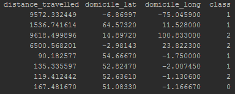

```{r setup, include=FALSE}
knitr::opts_chunk$set(echo = TRUE)
```

## Machine learning for loneliness score prediction

**_Question: Is the loneliness of students linked to the distance between their domicile and place of study?_**

the Support Vector Algorithm (SVM) is used in an attempt to classify student data into three classes. Lonely, neutral or not lonely. The result of the classifier would therefore be interpreted as, the input data correspond to a student who is likely to be lonely/ not likely to be lonely. Knowing the domicile and the distance travelled between the domicile and the place of study.


By mapping the loneliness score of the region in England to the student higher education provider location training sets are created. They contain the longitude and latitude of the student, the distance(km) between the domicile and the he provider and a binary representation of the loneliness zscore.

The classes are defined as follow:
<br>
 - class 0: region loneliness zscore <= 0
 <br>
  - class 1: 0 < region loneliness zscore < 1
 <br>
 - class 2: region loneliness zscore >= 1
 <br>
 
 
 
 
 The Linear Discriminant Analysis (LDA) technique allows to reduce the 3 dimentions( distance travelled, domicile latitude, domicile longitude) data set in a 2D space which can be visualized. 
 
  
  
  
**Results:**
<br>
Testing and visualization of the data reveals that the features used in the input, namely, the distance travelled, the domicile latitude and longitude do not describe how lonely a student may be. However the input data lack of resolution in the sense that it only takes into consideration the loneliness zscore of the region in England which induce very large amount of bias. Indeed the visualization tool developed shows that the zscore of the counties in England is highly variable. More importantly the distance travelled is not accurate as the exact location of study is not known, only the region of study is known in the data provided by HESA(Higher Education Statistics Agency) https://www.hesa.ac.uk/data-and-analysis/students/table-11.
<br>
  Further work would include the repeat of the experiment with data containing the exact migration of the students. The impact of features such as the level of study and mode of study should be explored too. 
  
  
  The source code for the trainning set generation and the classifier can be found at https://github.com/mcguinlu/JGI-Comp/tree/master/ml