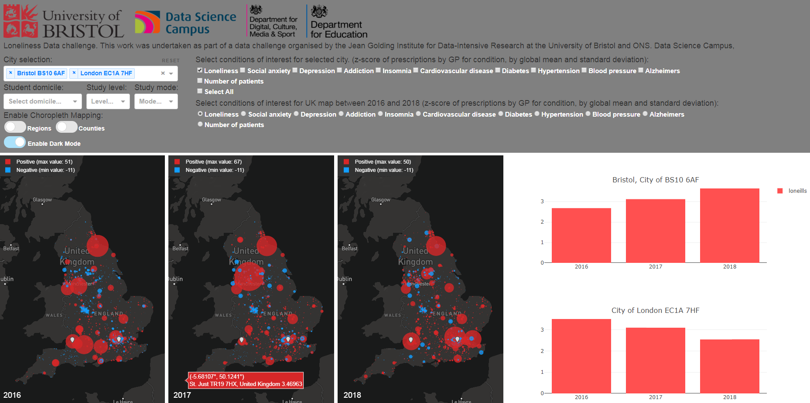
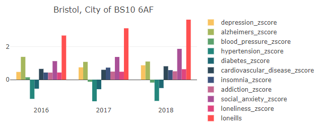
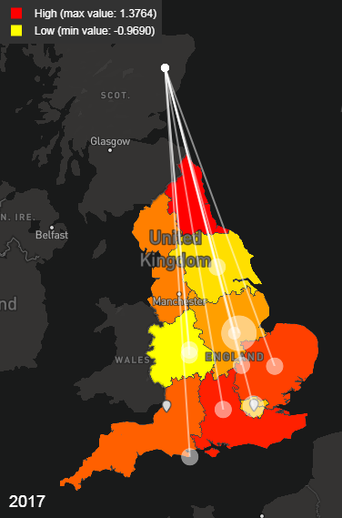

```{r setup, include=FALSE}
knitr::opts_chunk$set(echo = TRUE)
```

## Visualization of the data provided for the Loneliness data challenge.



In an attempt to better understand the data provided a visualization tool displaying the geographic and time distrubution of the zscore provided was developped. The tool takes form as a website accesible at the following web address <http://51.38.69.55/>.
<br>
<br>
**the program is hosted on a low performance private server. Acces to this server provided by the link above is for basic demonstration purposes. For proprer use and user interaction the program should be hosted on an appropriate server.**
<br>
<br>
The source dode is available at https://github.com/mcguinlu/JGI-Comp/tree/master/visualization.

This document explains the different features of the visualization.

## Control panel
Located in the upper section of the site the control panel allows to select what information will be displayed on the lower section.


## Bar graph
In the lower section on the right side is displayed the bar graph(s) of city selected in the control panel where one or multiple condition of interest can as well be selected. The x axis shows the year of the data collection. The y axis displays the zscore value(s) of the selected condition(s)    




## Map
In the lower sectionon the left is displayed 3 maps. They each displays the data for one year. The available years are 2016, 2017 and 2018. The data for only one condition can be displayed at a time. Different visualization mode are available including choropleth map of the regions or counties in England which uses gradiant coloring of the location or Scatter map which distinguishes data using different colors and sizes of the data points.


## Student migration
In order to visualize the migration of students from abroad to England the followibg dataset provided by HESA(Higher Education Statistics Agency) was used: https://www.hesa.ac.uk/data-and-analysis/students/table-11
The dataset information on the number of students moving to each English region, the domicile of the students, as well as their mode and level of study between 2014 and 2018.



Data visualization is an important step which allow a better understanding of any dataset before analysis. Here that data provided is displayed in its different form such that a clear view of the data distribution in England is achieved.  
